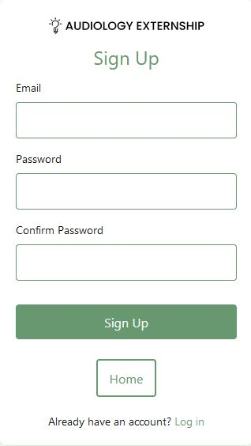
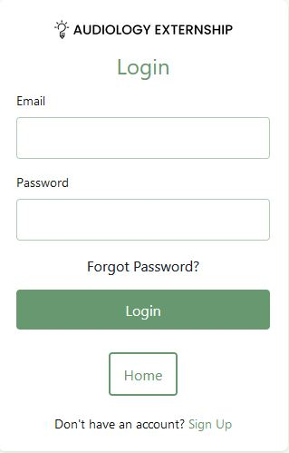
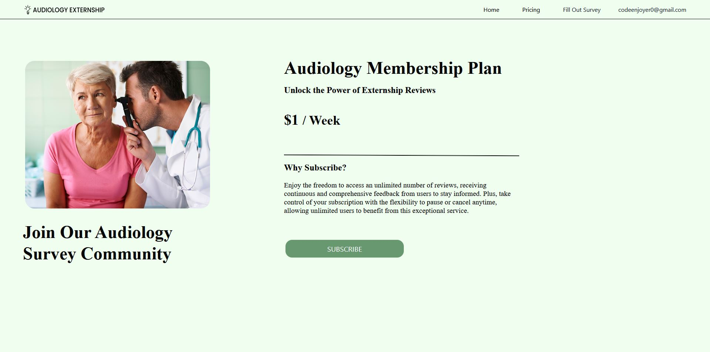
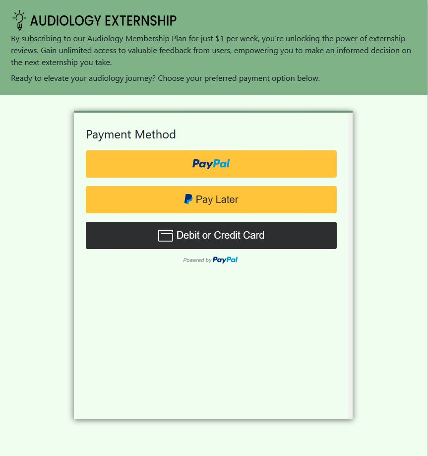
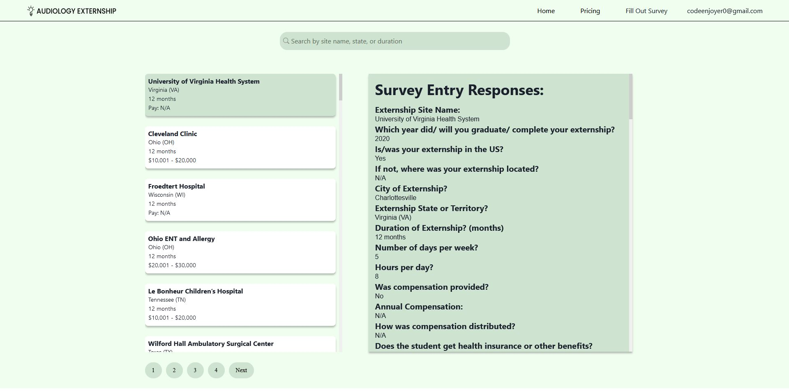

### Team Code Enjoyers
- Austin Dusa         adusa@csus.edu
- Jack Dusa           jdusa@csus.edu
- Omar Martinez       oamartinez@csus.edu
- Nolan Croisdale     nolancroisdale@csus.edu
- Quang Tran          quangntran@csus.edu
- Nazifullah Hanan    nhanan@csus.edu
- Alexander Vue       alexandervue@csus.edu
- Zabifullah Aryan    fnuzabihullah@csus.edu

## Problem Statement

Audiology externs lack adequate resources sharing their experiences. As a consequence, new externs struggle to find information about externships. Our client Professor Venkitakrishnan, who has previously collected data, has a critical need for a website that can improve this situation. What is needed here is a website for those externs to share their experiences with others through surveys, which is what we delivered in this project through our website, titled "Audiology Externship". The client expects this site to fulfill a critical need in her field as well as help students seeking externships. This website will serve both as a valuable resource for students looking to apply for externships and a data collection tool for departmental researchers. 

## Screenshots of Working Product

### Home Page

### SignUp Page

### SignIn Page

### Forgot Password Page

### Pricing Page

### PayPal Checkout Page

### Results Page

## Features

- Account Creation
- Ability to Fill Out Externship Surveys
- Subscription Service
- Searching & Browsing
- A Database to Support These Funcionalities

## Tech Stack

**Frontend:** React

**Backend:**  Firebase

**APIs:** PayPal API, Firestore Database, Firebase Hosting, Firebase Authentication

## Testing

**1.** Install jest dependencies using the following line in the terminal: npm install --save-dev @jest/globals

**2.** Install react scripts using the following line in the terminal: npm install react-scripts

**3.** In VS Code where the project is opened, navigate to the .test.js file(s) you wish to test

**4.** In the terminal, type “npm test (name of file).test.js”

From here, the tests from there should take 2-5 seconds to load and pass

## Deployment

- Navigate to the project on GitHub and click on the green button labeled “Code” and copy the HTTPS URL to the clipboard.
- Open a new Instance of VSCode and open a GitBash terminal
- On the command line, type "git clone", paste the link, and run the command.
- Open a new folder in VSCode and navigate to the "Code-Enjoyers-Senior-Project" folder created inside of the directory the "git clone" command was run in.
- Open a new GitBash command line in VSCode and run "npm install react-scripts" to install the necessary scripts to run the application. This command may take a few minutes to complete.
- Also run "npm install axios" which installs an additional dependency.
- Two files will be provided with the delivery of this project, a folder named “firebase” and a file named “clientId.json”. These two files need to be placed in the “/src” folder of the project.
- Run the command "npm run build" to create a production build of the React app.
- To host the React app on Firebase, "firebase login" must be run first which will open a prompt asking to login to Firebase.
- After logging in, run "firebase init" to begin initializing the project.
- Enter “Y” into the command line to proceed with the initialization
- Select the features “Realtime Database” and “Hosting” by selecting each feature with the space bar.
- Select “Use an existing project” for the next prompt.
- Press enter to use the recommended directory for the Firebase project.
- Press enter again to use the recommended file for the database security system rules.
- Enter “build” into the next prompt to use the folder created by the production build of the React app as the public directory.
- Enter “y” to configure the project as a single page app.
- Enter “N” to prevent the initializer from setting up automatic builds and deployments with GitHub.
- Enter “N” to prevent the initializer from overwriting the “index.html” file in the “build” folder.
- After answering the prompts above, the command line should show that the project is successfully initialized.
- Finally, run the command "firebase deploy" to deploy the project.